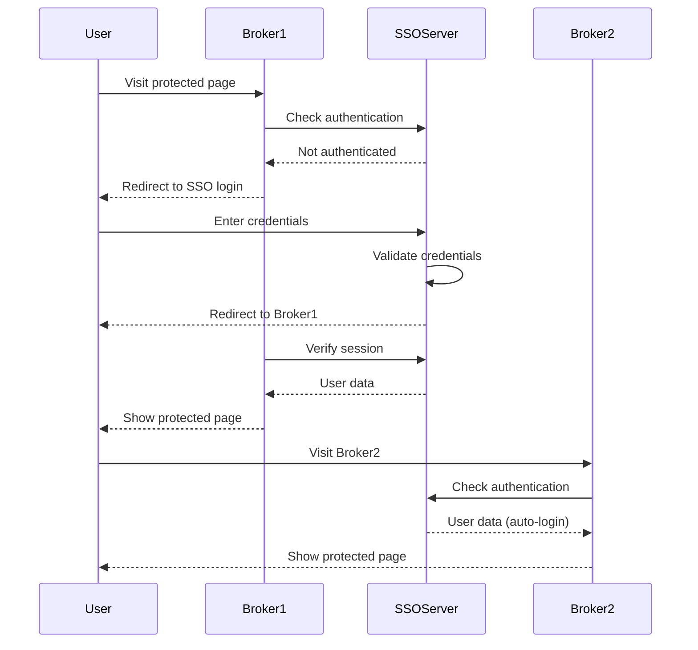

# API Documentation - Laravel 12 SSO

Complete API reference for the Laravel 12 Single Sign-On system.

## 🌐 Base URLs

- **SSO Server**: `http://localhost:8000/api/server`
- **Broker 1**: `http://localhost:8001`
- **Broker 2**: `http://localhost:8002`

## 🔐 Authentication

All API requests require proper broker authentication using:
- **Broker ID**: Unique identifier for each broker
- **Broker Secret**: Secret key for broker authentication
- **Session Token**: Generated session token for user sessions

## 📋 SSO Server Endpoints

### 1. Broker Attachment

**Endpoint**: `POST /attach`

Attaches a broker to the SSO server and establishes a session.

#### Request Parameters

| Parameter | Type | Required | Description |
|-----------|------|----------|-------------|
| `broker` | string | Yes | Broker identifier |
| `token` | string | Yes | Session token |
| `checksum` | string | Yes | Security checksum |

#### Request Example

```bash
curl -X POST http://localhost:8000/api/server/attach \
  -H "Content-Type: application/json" \
  -d '{
    "broker": "broker1",
    "token": "session_token_here",
    "checksum": "calculated_checksum"
  }'
```

#### Response

**Success (200)**:
```json
{
  "status": "success",
  "message": "Broker attached successfully"
}
```

**Error (400)**:
```json
{
  "error": "Invalid broker or checksum"
}
```

### 2. User Login

**Endpoint**: `POST /login`

Authenticates a user and creates an SSO session.

#### Request Parameters

| Parameter | Type | Required | Description |
|-----------|------|----------|-------------|
| `broker` | string | Yes | Broker identifier |
| `email` | string | Yes | User email address |
| `password` | string | Yes | User password |

#### Request Example

```bash
curl -X POST http://localhost:8000/api/server/login \
  -H "Content-Type: application/json" \
  -d '{
    "broker": "broker1",
    "email": "test@example.com",
    "password": "password123"
  }'
```

#### Response

**Success (200)**:
```json
{
  "status": "success",
  "user": {
    "id": 1,
    "name": "Test User",
    "email": "test@example.com",
    "created_at": "2025-05-27T10:00:00.000000Z",
    "updated_at": "2025-05-27T10:00:00.000000Z"
  }
}
```

**Error (401)**:
```json
{
  "error": "Invalid credentials"
}
```

### 3. Get User Information

**Endpoint**: `POST /userInfo`

Retrieves information about the currently authenticated user.

#### Request Parameters

| Parameter | Type | Required | Description |
|-----------|------|----------|-------------|
| `broker` | string | Yes | Broker identifier |

#### Request Example

```bash
curl -X POST http://localhost:8000/api/server/userInfo \
  -H "Content-Type: application/json" \
  -d '{
    "broker": "broker1"
  }'
```

#### Response

**Success (200)**:
```json
{
  "id": 1,
  "name": "Test User",
  "email": "test@example.com",
  "created_at": "2025-05-27T10:00:00.000000Z",
  "updated_at": "2025-05-27T10:00:00.000000Z"
}
```

**Error (401)**:
```json
{
  "error": "User not authenticated"
}
```

### 4. User Logout

**Endpoint**: `POST /logout`

Logs out the user and invalidates the SSO session across all brokers.

#### Request Parameters

| Parameter | Type | Required | Description |
|-----------|------|----------|-------------|
| `broker` | string | Yes | Broker identifier |

#### Request Example

```bash
curl -X POST http://localhost:8000/api/server/logout \
  -H "Content-Type: application/json" \
  -d '{
    "broker": "broker1"
  }'
```

#### Response

**Success (200)**:
```json
{
  "status": "success",
  "message": "User logged out successfully"
}
```

## 🔗 Broker Endpoints

### 1. SSO Login

**Endpoint**: `GET /sso/login`

Initiates the SSO login process by redirecting to the SSO server.

#### Query Parameters

| Parameter | Type | Required | Description |
|-----------|------|----------|-------------|
| `return_url` | string | No | URL to redirect after login |

#### Request Example

```bash
curl -X GET "http://localhost:8001/sso/login?return_url=/dashboard"
```

#### Response

**Redirect (302)**: Redirects to SSO server login page

### 2. SSO Logout

**Endpoint**: `GET /sso/logout`

Initiates the SSO logout process.

#### Request Example

```bash
curl -X GET http://localhost:8001/sso/logout
```

#### Response

**Redirect (302)**: Redirects to login page after logout

### 3. Protected Routes

**Endpoint**: `GET /home`

Example of a protected route that requires SSO authentication.

#### Request Example

```bash
curl -X GET http://localhost:8001/home \
  -H "Cookie: laravel_session=session_value"
```

#### Response

**Success (200)**: Returns the protected page content

**Redirect (302)**: Redirects to SSO login if not authenticated

## 🔒 Security & Checksums

### Checksum Calculation

Checksums are calculated using the following formula:

```php
$checksum = hash('sha256', $broker . $token . $secret);
```

#### Example Checksum Calculation

```php
$broker = 'broker1';
$token = 'abc123def456';
$secret = 'broker1_secret_key';

$checksum = hash('sha256', $broker . $token . $secret);
// Result: "a1b2c3d4e5f6..."
```

### Session Token Format

Session tokens are generated using:

```php
$token = bin2hex(random_bytes(16));
// Result: "1a2b3c4d5e6f7g8h9i0j1k2l3m4n5o6p"
```

## 📊 Response Codes

| Code | Status | Description |
|------|--------|-------------|
| 200 | OK | Request successful |
| 302 | Found | Redirect response |
| 400 | Bad Request | Invalid request parameters |
| 401 | Unauthorized | Authentication required |
| 403 | Forbidden | Access denied |
| 404 | Not Found | Endpoint not found |
| 500 | Internal Server Error | Server error |

## 🔄 SSO Flow Diagram



## 🧪 Testing API Endpoints

### Using cURL

```bash
# Test broker attachment
curl -X POST http://localhost:8000/api/server/attach \
  -H "Content-Type: application/json" \
  -d '{"broker":"broker1","token":"test_token","checksum":"test_checksum"}'

# Test user login
curl -X POST http://localhost:8000/api/server/login \
  -H "Content-Type: application/json" \
  -d '{"broker":"broker1","email":"test@example.com","password":"password123"}'
```

### Using Postman

1. **Import Collection**: Create a Postman collection with all endpoints
2. **Set Environment**: Configure base URLs and authentication
3. **Test Flows**: Test complete SSO flows
4. **Automate**: Set up automated testing

### Using PHPUnit

```php
// Example API test
public function test_user_login_api()
{
    $response = $this->postJson('/api/server/login', [
        'broker' => 'broker1',
        'email' => 'test@example.com',
        'password' => 'password123'
    ]);

    $response->assertStatus(200)
             ->assertJsonStructure(['status', 'user']);
}
```

## 📝 Rate Limiting

### Default Limits

- **Login attempts**: 5 per minute per IP
- **API requests**: 60 per minute per broker
- **Session creation**: 10 per minute per IP

### Custom Rate Limiting

Configure in `config/app.php`:

```php
'rate_limits' => [
    'login' => '5,1',      // 5 attempts per minute
    'api' => '60,1',       // 60 requests per minute
    'session' => '10,1',   // 10 sessions per minute
],
```

## 🔍 Debugging

### Enable Debug Mode

Set in `.env`:

```env
APP_DEBUG=true
LOG_LEVEL=debug
```

### Debug Headers

Add debug information to responses:

```php
// In controller
return response()->json($data)->header('X-Debug-Info', $debugData);
```

### Logging API Requests

```php
// Log all API requests
Log::info('API Request', [
    'endpoint' => request()->path(),
    'method' => request()->method(),
    'data' => request()->all(),
    'broker' => request()->input('broker'),
]);
```

## 🚀 Performance Optimization

### Caching

```php
// Cache user data
Cache::put("user_{$userId}", $userData, 3600);

// Cache broker sessions
Cache::put("session_{$sessionId}", $sessionData, 7200);
```

### Database Optimization

```php
// Use database indexes
Schema::table('users', function (Blueprint $table) {
    $table->index('email');
    $table->index(['broker_id', 'session_token']);
});
```

## 📚 Additional Resources

- **Postman Collection**: [Download API collection](../examples/postman-collection.json)
- **OpenAPI Spec**: [View OpenAPI specification](../api/openapi.yaml)
- **SDK Examples**: [Language-specific SDKs](../examples/sdks/)
- **Integration Guide**: [Step-by-step integration](../examples/integration-guide.md)