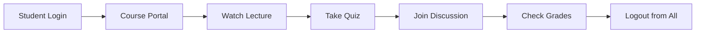

# Real-World Use Cases - Laravel 12 SSO

Discover how Laravel 12 SSO can solve authentication challenges across various industries and application types.

## 🏢 Enterprise & Corporate

### 1. Corporate Intranet Portal

**Scenario**: Large corporation with multiple internal applications
- **HR Portal**: Employee management, payroll, benefits
- **CRM System**: Customer relationship management
- **Project Management**: Task tracking, time management
- **Document Management**: File sharing, collaboration

**Implementation**:
```bash
# SSO Server: Central authentication
# Broker 1: HR Portal (hr.company.com)
# Broker 2: CRM System (crm.company.com)
# Broker 3: Project Management (pm.company.com)
# Broker 4: Document Management (docs.company.com)
```

**Benefits**:
- ✅ Single login for all company systems
- ✅ Centralized user management
- ✅ Improved security compliance
- ✅ Reduced IT support tickets

### 2. Multi-Department Dashboard

**Scenario**: University with separate systems for different departments

**Applications**:
- **Student Portal**: Grades, schedules, registration
- **Faculty Portal**: Course management, grading
- **Admin Portal**: System administration, reports
- **Library System**: Book management, reservations

**Configuration**:
```env
# Student Portal
SSO_BROKER_ID=student_portal
SSO_BROKER_SECRET=student_secret_key

# Faculty Portal
SSO_BROKER_ID=faculty_portal
SSO_BROKER_SECRET=faculty_secret_key

# Admin Portal
SSO_BROKER_ID=admin_portal
SSO_BROKER_SECRET=admin_secret_key
```

## 🛒 E-commerce & SaaS

### 3. Multi-Store E-commerce Platform

**Scenario**: E-commerce company with multiple brand stores

**Stores**:
- **Main Store**: Primary brand (store1.company.com)
- **Outlet Store**: Discounted products (outlet.company.com)
- **B2B Store**: Wholesale portal (b2b.company.com)
- **Customer Service**: Support portal (support.company.com)

**User Experience**:
1. Customer logs into Main Store
2. Automatically logged into Outlet Store when visiting
3. Seamless access to B2B portal if authorized
4. Single logout from any store logs out everywhere

**Code Example**:
```php
// In each store's controller
public function dashboard()
{
    $user = $this->broker->getUserInfo();
    
    if (!$user) {
        return redirect($this->broker->getLoginUrl());
    }
    
    // Store-specific logic
    $storeData = $this->getStoreSpecificData($user);
    
    return view('dashboard', compact('user', 'storeData'));
}
```

### 4. SaaS Application Suite

**Scenario**: Software company offering integrated business tools

**Applications**:
- **Accounting Software**: Financial management
- **Inventory Management**: Stock tracking
- **Customer Support**: Ticket system
- **Analytics Dashboard**: Business intelligence

**Implementation Benefits**:
- 🔄 Seamless switching between applications
- 📊 Unified user analytics across all tools
- 💰 Simplified billing and subscription management
- 🔒 Centralized security and compliance

## 🎓 Educational Institutions

### 5. Learning Management System

**Scenario**: Online education platform with multiple learning environments

**Platforms**:
- **Course Portal**: Video lectures, assignments
- **Testing Platform**: Quizzes, exams
- **Discussion Forum**: Student collaboration
- **Grade Portal**: Progress tracking

**Student Journey**:


**Teacher Benefits**:
- 📚 Single interface for all teaching tools
- 📈 Comprehensive student progress tracking
- ⏰ Time-saving with unified authentication
- 🔐 Secure access to sensitive grade data

### 6. Campus Management System

**Scenario**: University with integrated campus services

**Services**:
- **Academic Portal**: Course registration, transcripts
- **Library System**: Book reservations, digital resources
- **Dining Services**: Meal plan management
- **Housing Portal**: Dormitory assignments
- **Financial Aid**: Scholarship and loan management

## 🏥 Healthcare & Medical

### 7. Hospital Information System

**Scenario**: Hospital with multiple specialized systems

**Systems**:
- **Electronic Health Records (EHR)**: Patient data
- **Appointment Scheduling**: Patient bookings
- **Billing System**: Insurance and payments
- **Pharmacy Management**: Medication tracking
- **Lab Results**: Test results and reports

**Security Considerations**:
```php
// Enhanced security for healthcare
class HealthcareSSO extends MySSOServer
{
    protected function validateUser($credentials)
    {
        // Additional HIPAA compliance checks
        $user = parent::validateUser($credentials);
        
        if ($user) {
            // Log access for audit trail
            $this->logHealthcareAccess($user, request()->ip());
            
            // Check user permissions for specific systems
            $this->validateHealthcarePermissions($user);
        }
        
        return $user;
    }
}
```

## 🔧 Development & DevOps

### 8. Development Environment Management

**Scenario**: Software development company with multiple environments

**Environments**:
- **Development Portal**: Code repositories, CI/CD
- **Testing Platform**: Automated testing, QA tools
- **Staging Environment**: Pre-production testing
- **Production Monitoring**: System monitoring, logs
- **Documentation Portal**: API docs, wikis

**Developer Workflow**:
1. Login to Development Portal
2. Access code repositories and CI/CD tools
3. Deploy to Testing Platform automatically
4. Review in Staging Environment
5. Monitor in Production Dashboard
6. Update Documentation Portal

### 9. API Gateway Integration

**Scenario**: Microservices architecture with centralized authentication

**Services**:
- **User Service**: User management API
- **Product Service**: Product catalog API
- **Order Service**: Order processing API
- **Payment Service**: Payment processing API
- **Notification Service**: Email/SMS notifications

**API Authentication Flow**:
```php
// API Gateway middleware
class SSOApiMiddleware
{
    public function handle($request, Closure $next)
    {
        $token = $request->bearerToken();
        
        if (!$this->validateSSOToken($token)) {
            return response()->json(['error' => 'Unauthorized'], 401);
        }
        
        $user = $this->getUserFromToken($token);
        $request->setUserResolver(function () use ($user) {
            return $user;
        });
        
        return $next($request);
    }
}
```

## 🌐 Multi-Tenant Applications

### 10. White-Label SaaS Platform

**Scenario**: SaaS provider offering white-label solutions to clients

**Client Implementations**:
- **Client A**: Real estate management (realestate-a.com)
- **Client B**: Restaurant chain management (restaurant-b.com)
- **Client C**: Retail store management (retail-c.com)

**Multi-Tenant SSO Configuration**:
```php
// Tenant-aware SSO server
class MultiTenantSSOServer extends MySSOServer
{
    protected function validateBroker($brokerId, $brokerSecret)
    {
        $tenant = $this->getTenantFromBroker($brokerId);
        
        if (!$tenant || !$tenant->isActive()) {
            throw new Exception('Invalid tenant');
        }
        
        return parent::validateBroker($brokerId, $brokerSecret);
    }
    
    protected function getUserInfo()
    {
        $user = parent::getUserInfo();
        
        if ($user) {
            // Add tenant-specific data
            $user['tenant'] = $this->getCurrentTenant();
            $user['permissions'] = $this->getTenantPermissions($user['id']);
        }
        
        return $user;
    }
}
```

## 📊 Analytics & Business Intelligence

### 11. Business Intelligence Dashboard

**Scenario**: Company with multiple data analysis tools

**Tools**:
- **Sales Analytics**: Revenue tracking, forecasting
- **Marketing Dashboard**: Campaign performance
- **Operations Metrics**: Efficiency tracking
- **Financial Reports**: Budget analysis
- **Customer Insights**: Behavior analysis

**Unified Analytics**:
```php
// Track user activity across all BI tools
class AnalyticsSSO extends MySSOServer
{
    protected function attachBroker($brokerId, $token)
    {
        $result = parent::attachBroker($brokerId, $token);
        
        // Track broker usage
        Analytics::track('broker_access', [
            'broker_id' => $brokerId,
            'user_id' => $this->getUserId(),
            'timestamp' => now(),
            'ip_address' => request()->ip()
        ]);
        
        return $result;
    }
}
```

## 🚀 Implementation Tips

### Performance Optimization

```php
// Cache user data across brokers
class CachedSSO extends MySSOServer
{
    protected function getUserInfo()
    {
        $sessionId = $this->getSessionId();
        
        return Cache::remember("sso_user_{$sessionId}", 3600, function () {
            return parent::getUserInfo();
        });
    }
}
```

### Security Enhancements

```php
// Add IP validation for sensitive applications
class SecureSSO extends MySSOServer
{
    protected function validateSession($sessionId)
    {
        $session = parent::validateSession($sessionId);
        
        if ($session && $this->isHighSecurityBroker()) {
            $this->validateIPAddress($session);
        }
        
        return $session;
    }
}
```

### Monitoring & Logging

```php
// Comprehensive logging for audit trails
class AuditableSSO extends MySSOServer
{
    protected function login($credentials)
    {
        $result = parent::login($credentials);
        
        Log::info('SSO Login Attempt', [
            'email' => $credentials['email'],
            'success' => $result !== null,
            'ip' => request()->ip(),
            'user_agent' => request()->userAgent(),
            'broker' => $this->getBrokerId()
        ]);
        
        return $result;
    }
}
```

## 📈 Scaling Considerations

### Load Balancing
- Use Redis for session storage across multiple servers
- Implement database read replicas for user data
- Cache broker configurations for faster validation

### High Availability
- Deploy SSO server in multiple regions
- Implement health checks and failover mechanisms
- Use CDN for static assets and documentation

### Monitoring
- Track authentication success/failure rates
- Monitor session creation and destruction
- Alert on unusual authentication patterns

---

**Ready to implement SSO for your use case?** Check out our [Quick Start Guide](../installation/quick-start.md) to get started in minutes!